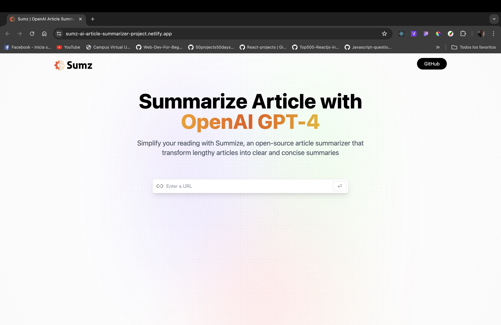
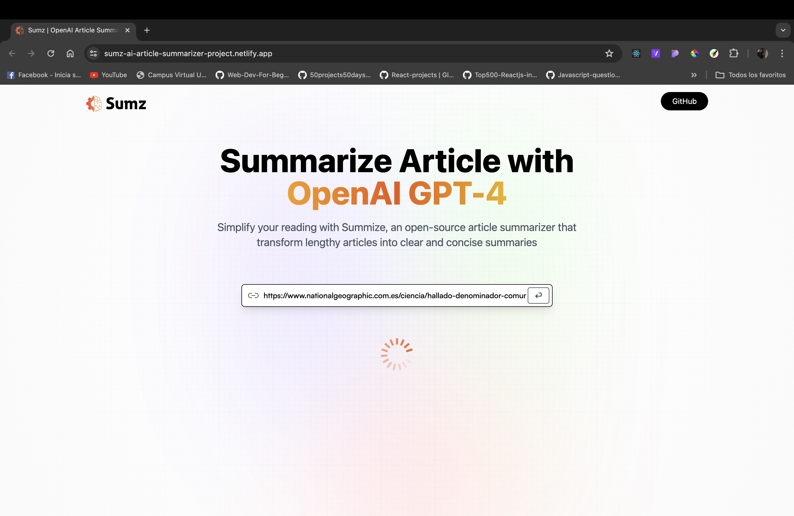
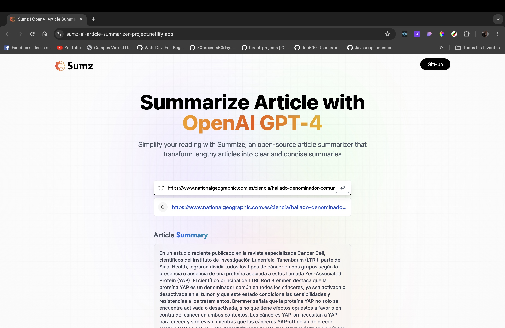
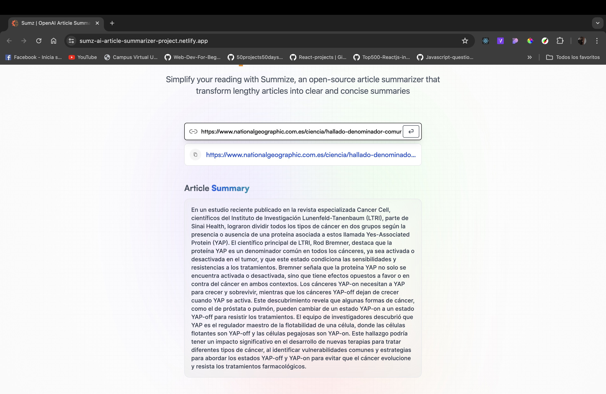
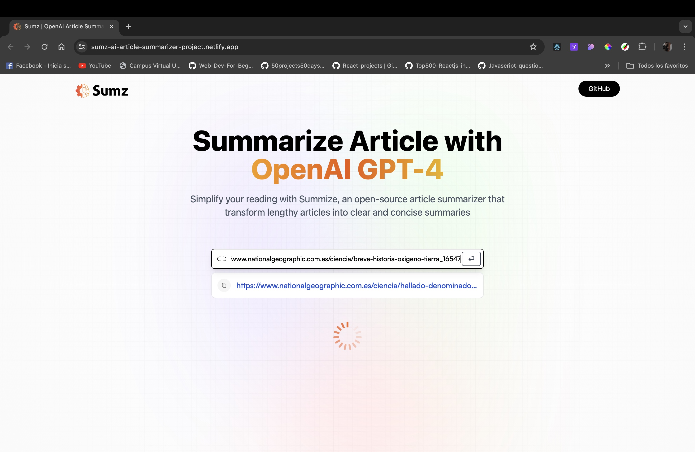
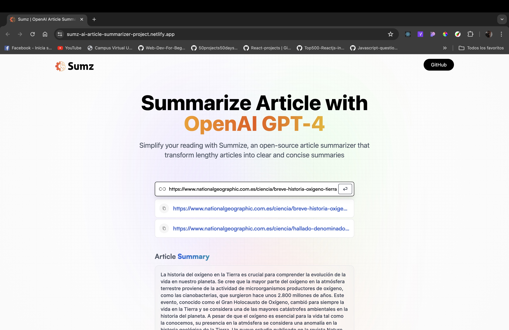
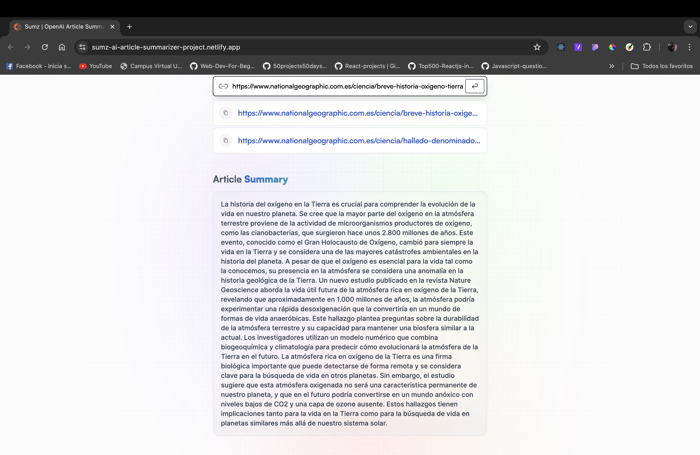
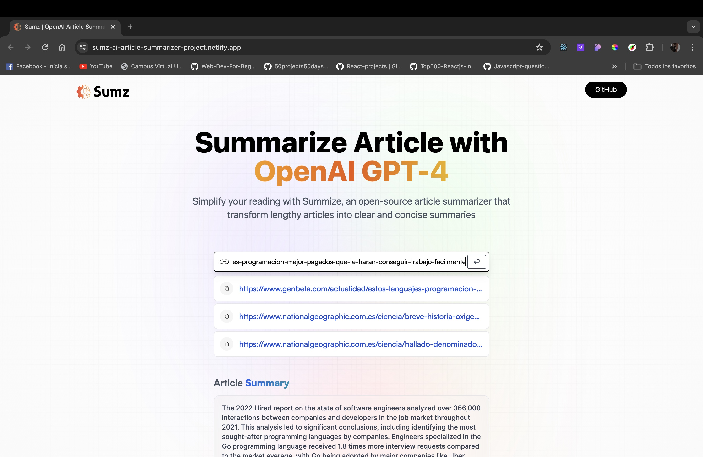
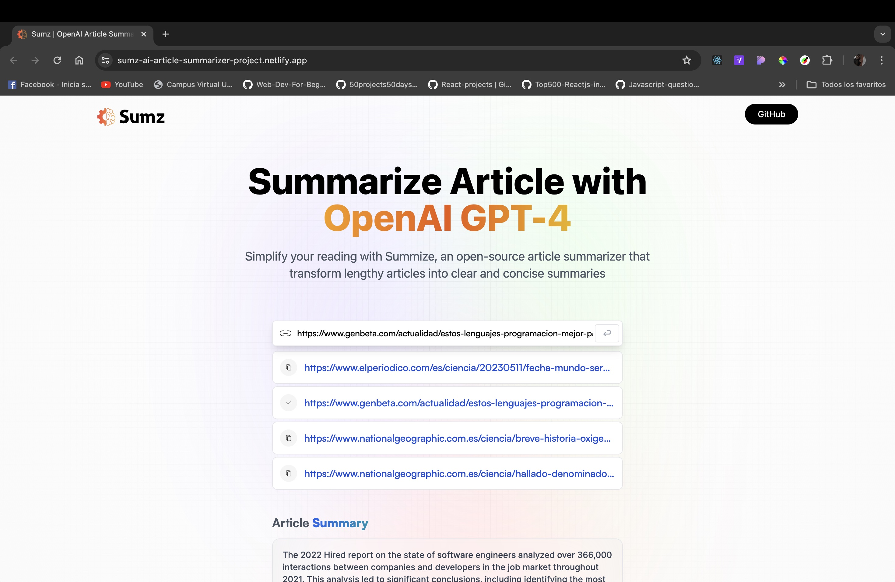
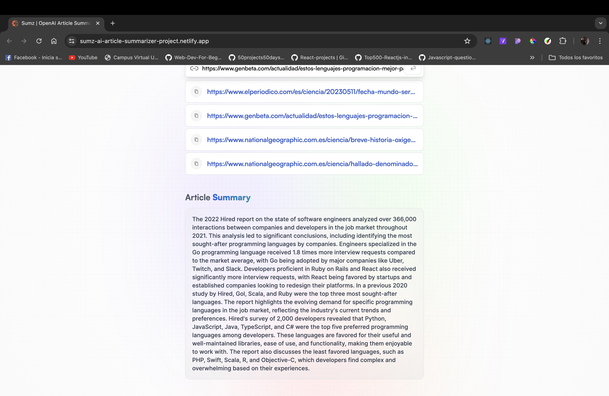

# SUMZ-AI-SUMMARIZER-PROJECT

## <a name="tech-stack">⚙️ Tech Stack</a>

- React.js
- TypeScript
- Redux Toolkit
- Tailwind CSS

## <a name="features">🔋 Features</a>

👉 **Modern User Interface**: A modern and user-friendly interface, offering an intuitive experience for users.

👉 **Summary Generation**: Users can input the URL of a lengthy article, and the web app utilizes AI to provide a concise summary of the article content.

👉 **History Saving with Local Storage**: The app includes a history feature, allowing users to save summaries locally, providing a convenient way to revisit and manage their reading history.

👉 **Copy to Clipboard Functionality**: Enables users to easily share or store the summarized content by copying it to their clipboard.

👉 **Advanced RTK Query API Requests**: Utilizes the advanced capabilities of Redux Toolkit (RTK) Query for making API requests. These requests fire conditionally based on specific criteria, optimizing data fetching and management.

and many more, including code architecture and reusability 

##

