# 🚀 AI SUMMARIZER: Intelligent Content Condensation Tool

## **[STRATEGIC ARCHITECTURE & BUSINESS VALUE**

### 🎯 Identified Market Problem & Value Proposition

> **Core Problem:** Information overload and the time inefficiency of synthesizing long-form articles or documents quickly.
>
> **T-Shape Solution:** A user-facing utility that leverages **OpenAI/RapidAPI** to instantly condense content. The solution focuses on delivering quick, accurate summaries while demonstrating proficiency in **API cost management** and external service integration.

### 📈 Key Metrics, Anti-AI Strategy, and Business Alignment

*   **Performance Priority:** Low latency response time from the AI API and robust error handling to manage external service failures.
*   **Strategy Anti-AI:** Proves the T-Shape ability to **architect cost-effective solutions around expensive AI services** (API cost governance) and translate raw API outputs into clean, functional UI/UX components.
*   **Monetization/Value Stream:** High utility focus, demonstrating potential for a subscription or credit-based SaaS model.

---

## **DEEP SOFTWARE ARCHITECTURE**

### 🛠️ Core Technology Stack

| Technology | Role and Strategic Justification |
| :--- | :--- |
| **Framework** | ReactJs / Next.js (TypeScript) |
| **Backend/DB** | RapidAPI / OpenAI / (Implied: Caching or History DB) |
| **Styling** | Tailwind CSS |
| **Auth** | None (Utility Focus) |
| **AI/Services** | Fetch API, Asynchronous Data Handling |

### ⚙️ Key Architectural Decisions

1.  **Next.js (API Routes):** Crucial for securely handling and proxying the external API calls (OpenAI/RapidAPI) on the server-side, protecting sensitive API keys.
2.  **TypeScript:** Used for managing the structure of data sent to and received from the AI endpoint, ensuring consistency and reliability in data transformation.
3.  **Efficient API Calling:** Architectural focus on optimizing asynchronous data flow and potentially implementing caching mechanisms to reduce repetitive calls and latency.

---

## **T-SHAPE SUPERPOWERS & EXECUTION CHALLENGES**

### 🧠 Strategic Challenges Overcome

*   **Challenge 1:** Managing the **latency and potential rate limits** from third-party AI APIs.
*   **Solution 1:** Implemented state control for loading and error conditions, providing transparent user feedback during API processing.
*   **Challenge 2:** Ensuring the **accuracy and secure transmission** of data to the summarization endpoint.
*   **Solution 2:** Strict use of server-side logic and validation for data integrity.

### 💻 Local Setup (Quick Start)

```bash
# 1. Clone the repository
git clone https://github.com/saulkurosaki/AI-SUMMARIZER-PROJECT

# 2. Change directory
cd AI-SUMMARIZER-PROJECT

# 3. Install dependencies
npm install

# 4. Configure environment variables
# Create a .env.local file and add the necessary API keys (e.g., RapidAPI/OpenAI).

# 5. Start Development Server
npm run dev
```
---

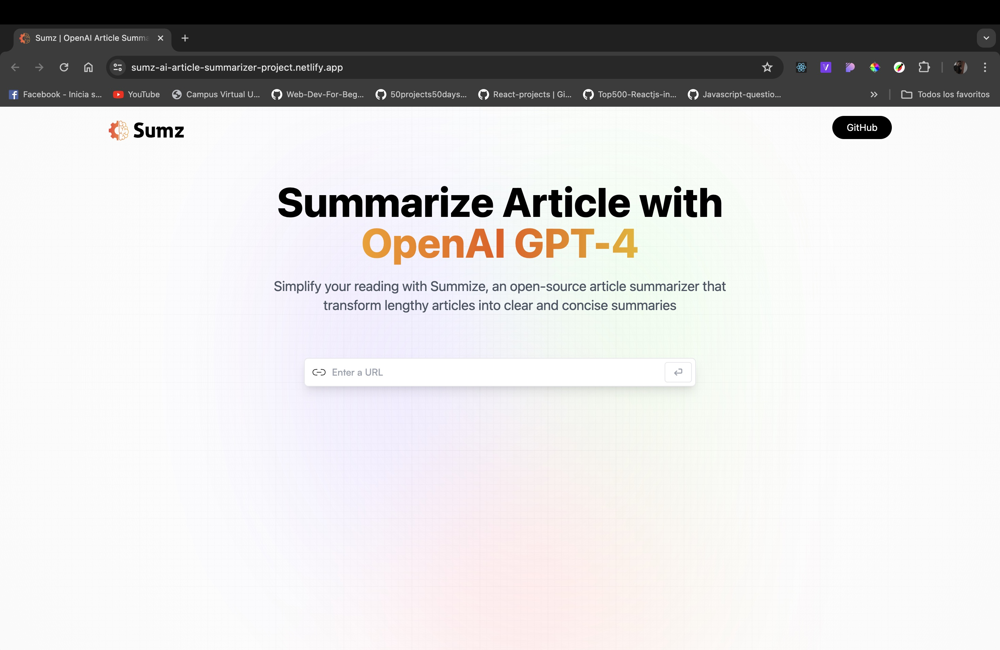
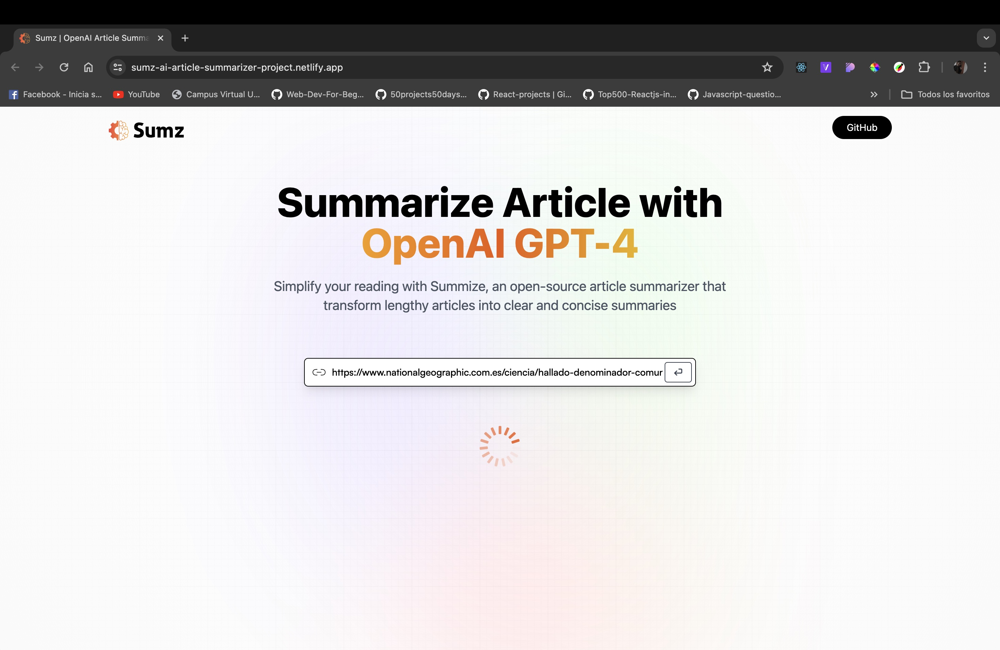
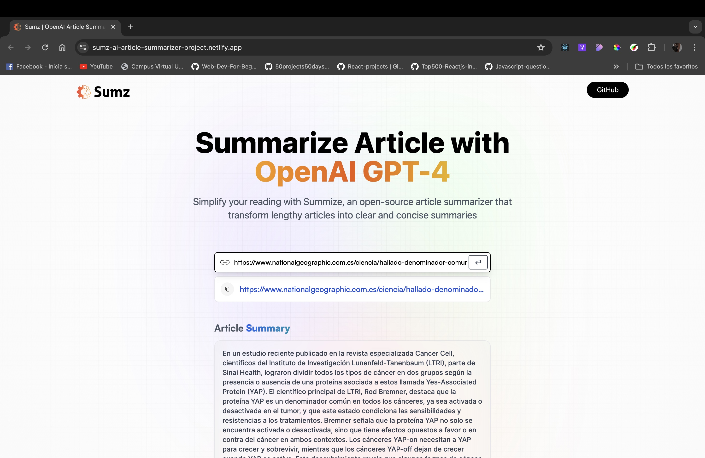
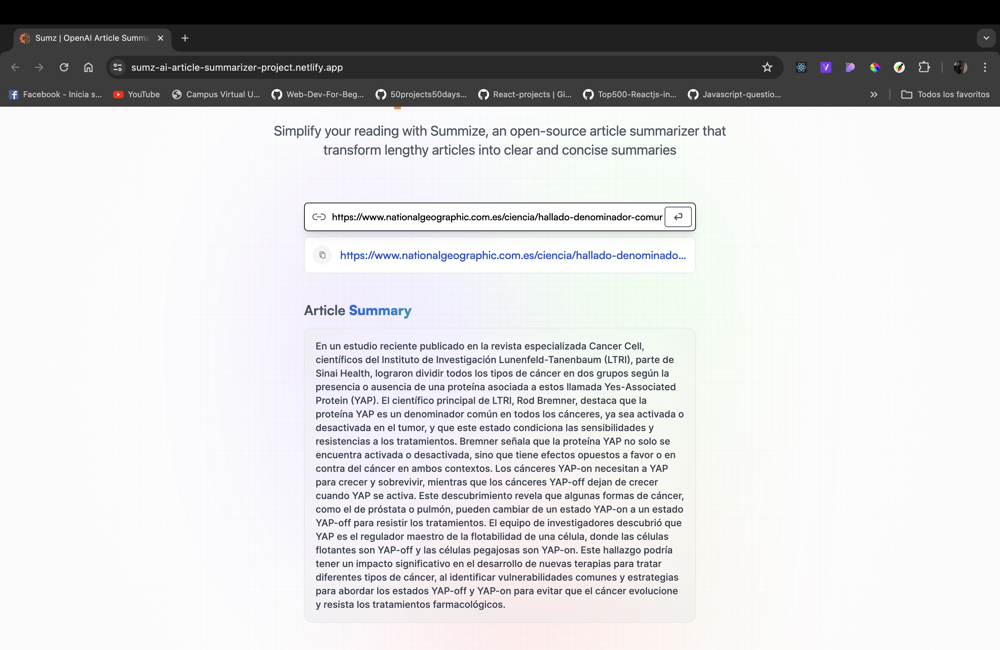
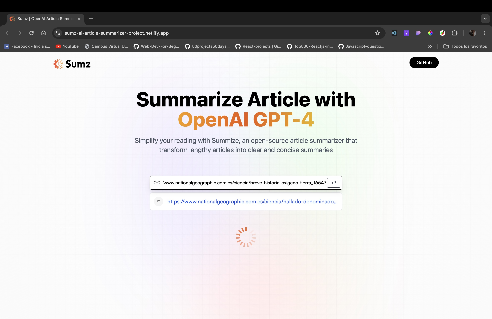
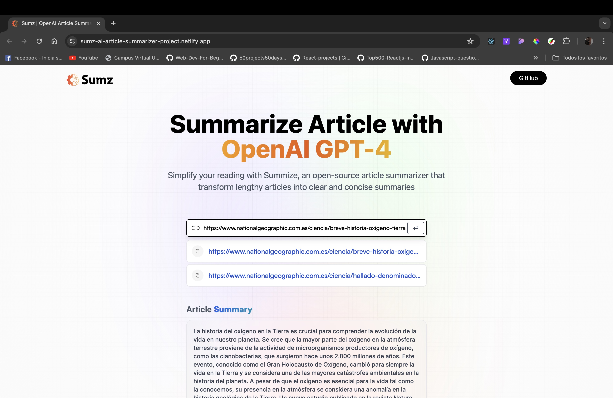
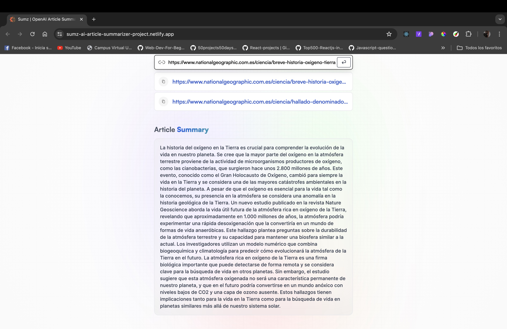
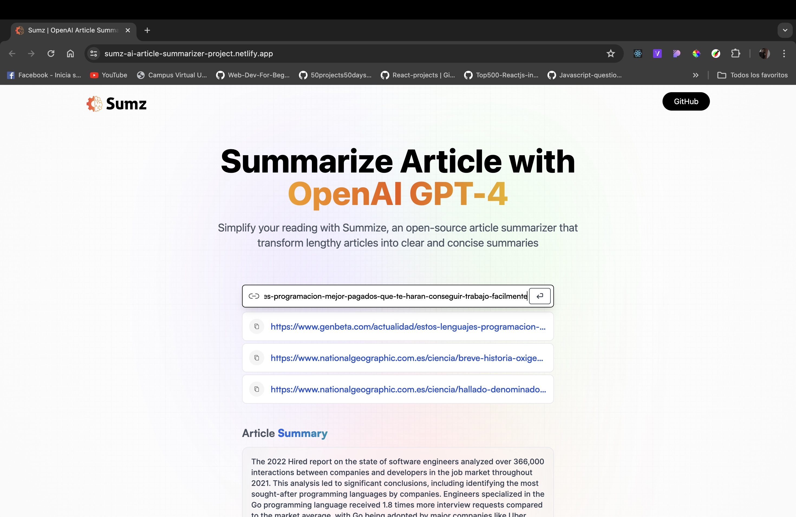
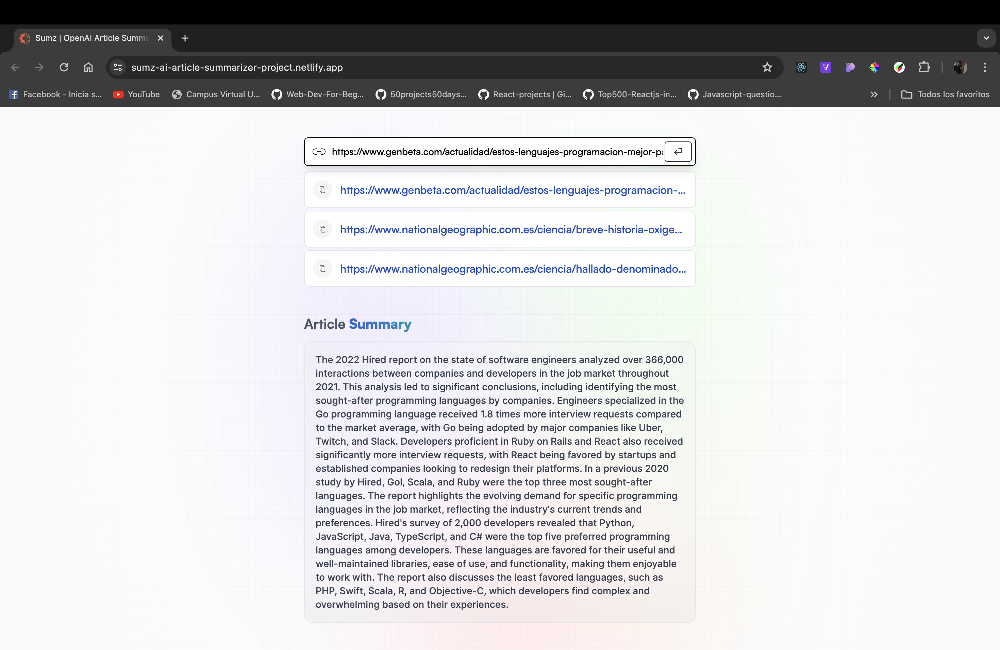
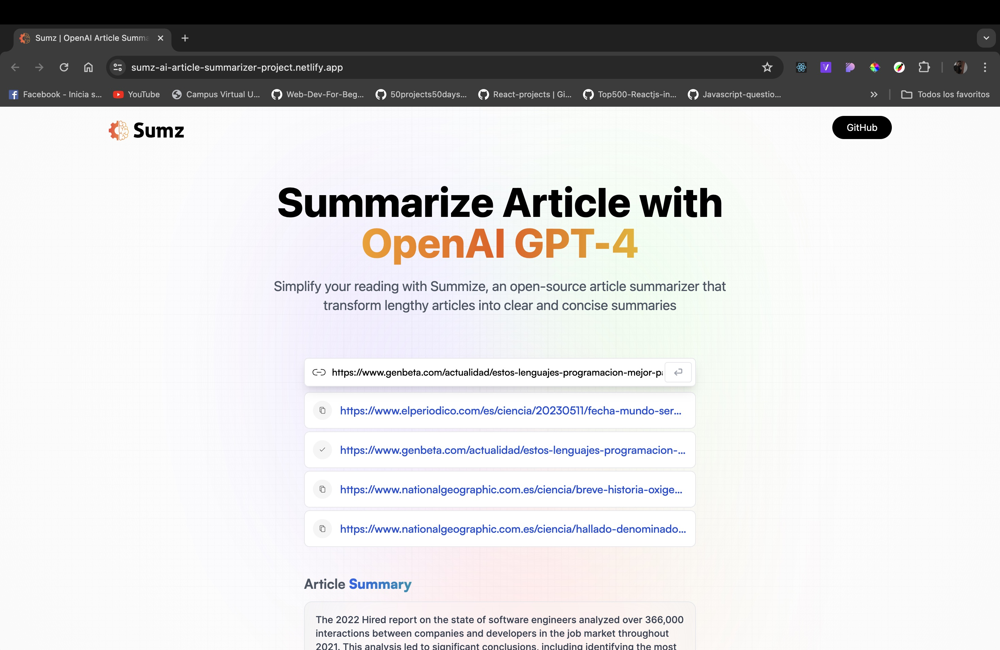
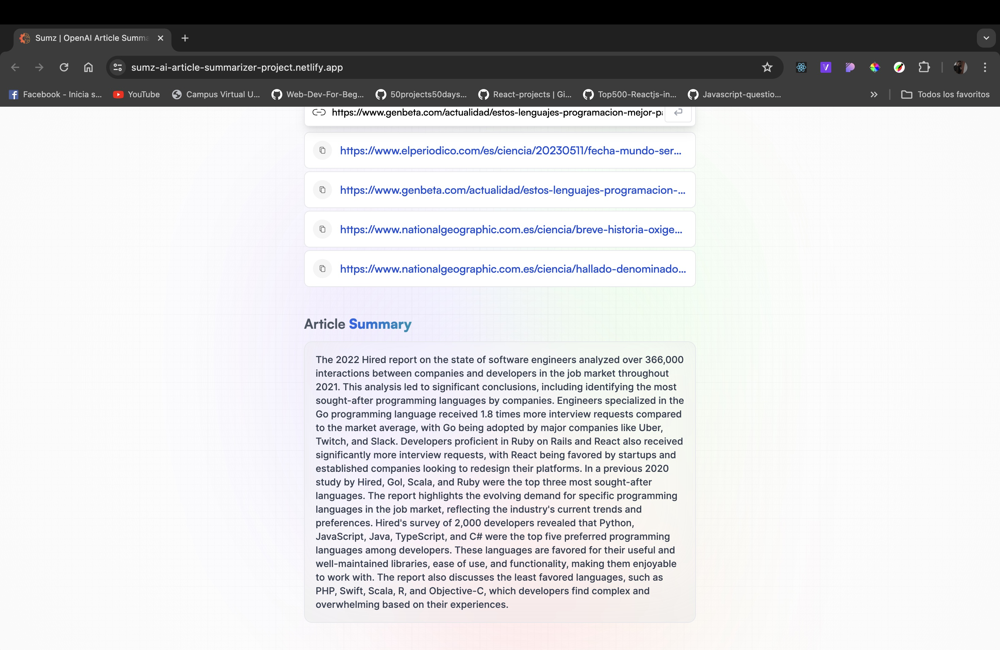
